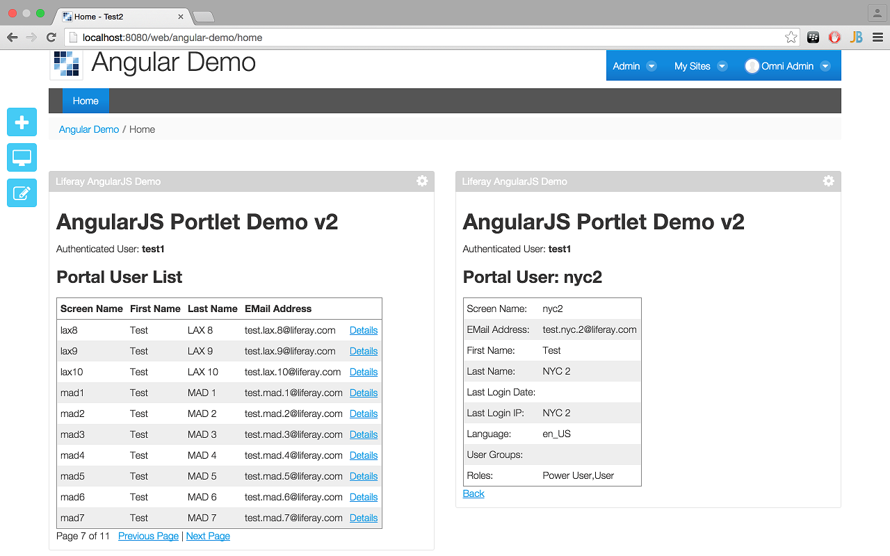
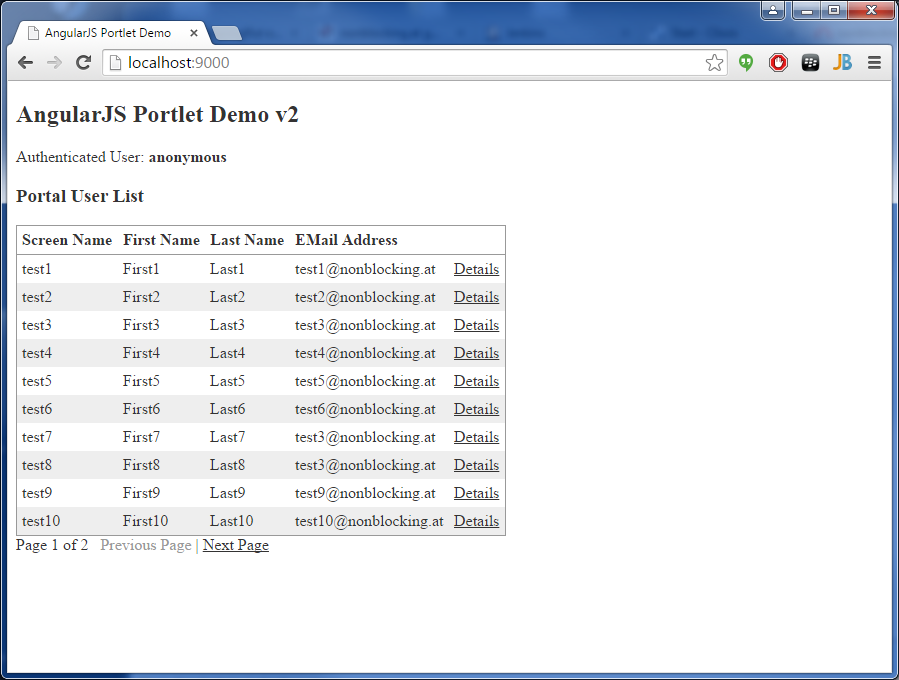

AngularJS Portlet Demo v3
=========================

A Liferay portlet that just list all users and shows how AngularJS and Spring Portlet MVC can be used to create single page HTML5 portlets.

The demonstrator consists of two parts:

1. A [Spring Portlet MVC](http://docs.spring.io/spring/docs/4.0.x/spring-framework-reference/html/portlet.html) backend that handles all AJAX requests as resource requests. 
   It leverages the [thymeleaf](http://www.thymeleaf.org/) HTML5 template engine to pass the resource URL and other parameters as JavaScript variables to the frontend. 
2. An [AngularJS](https://angularjs.org/) frontend that can also be run **standalone with node.js**, which can greatly accelerate the development.

## Build

### Prerequisites
* [Maven](https://maven.apache.org/) build tool (should come with your favorite IDE)
* [node.js](http://nodejs.org/) and [Grunt](http://gruntjs.com/) to build and run the HTML5/JavaScript code
* [SASS](http://sass-lang.com/) to compile the Sassy CSS into CSS

### Create the WAR file

Just run **mvn package** on the command line.

## Run

### On a Liferay 6.2 Portal

Drop the generated _liferay-angularjs-portlet-*.war_ file in the_target_ directory into the *{liferay-home}/deploy* folder.
Alternatively execute on the command line: **mvn liferay:deploy -D\<base_path_of_your_lifery_installation\>**

### Standalone

Run **npm install** and **grunt server** in the root directory of the project. The webapp will be available on *localhost:9000*.

## Notes

* To run the portlet on a Liferay 6.1 portal two files need to be changed:  
    1. In *liferay-portlet.xml* change the doctype from *6.2.0.dtd* to *6.0.0.dtd* and remove the line *&lt;requires-namespaced-parameters&gt;false&lt;/requires-namespaced-parameters&gt;*
    2. In *liferay-plugin-package.properties* change the *liferay-versions* property to *6.1.0+,6.1.2+*
* The AngularJS portlet in this demonstrator is **instanceable**, which means that you can place it multiple times on a single portal page 
* In order to allow multiple angular based portlets on a page *angular-route* cannot be used
* If you plan to make a whole suite of AngularJS portlets you should put all JavaScript base libraries and base modules into your theme
  (instead of shipping it with every single portlet).
* In the standalone version live-reload is activated, so whenever you change a SASS or JS file the browser will refresh automatically.  
* In a real world app **don't forget Java and JavaScript unit tests**!

## Screenshots

### Liferay 6.2

### Standalone

